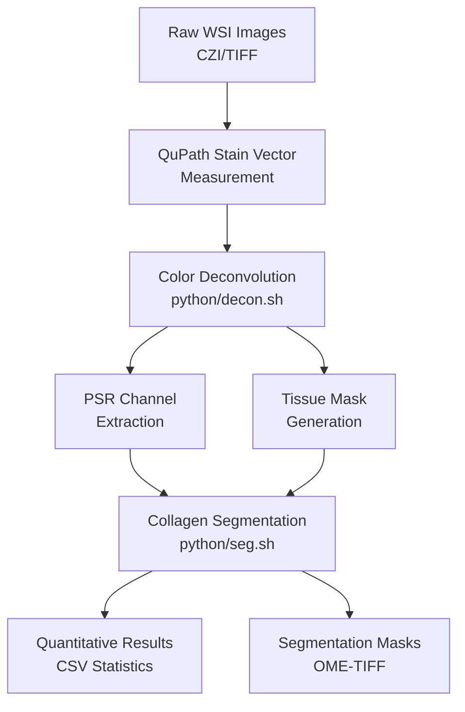

# Histology Collagen Quantification

High resolution histology slice scanning quantification with PSR (Picrosirius Red) + FG (Fast Green) staining for automated collagen detection and quantification.

## Overview

This pipeline provides automated analysis of histological images stained with PSR+FG to quantify collagen content in tissue samples. The workflow combines color deconvolution techniques with advanced segmentation algorithms to provide accurate, reproducible measurements suitable for research applications.

## Pipeline Features

1. **Multi-format image support**: CZI, TIFF, OME-TIFF file formats
2. **Color deconvolution**: User-defined stain vectors compatible with QuPath measurements
3. **Automated tissue detection**: Multi-level Otsu thresholding with morphological operations
4. **Scalable processing**: Tiled processing for large whole slide images
5. **Quantitative analysis**: Regional and global collagen density measurements
6. **Output formats**: Pyramidal OME-TIFF for visualization and CSV for statistical analysis

## Workflow Overview



## Quick Start

### 1. Environment Setup

Three methods are available for setting up the environment, listed in order of recommendation:

#### Option 1: Docker (Recommended)

Docker provides the most reproducible and isolated environment with all dependencies pre-installed.

```bash
# Build the Docker image
docker build -t collagen-quant .

# Run interactive shell
docker run -it --rm \
  -v /path/to/your/data:/data \
  collagen-quant

# Inside the container, activate pixi environment
pixi shell
```

See the [Docker Usage](#docker-usage) section below for detailed instructions including Jupyter notebook integration, Apptainer/Singularity conversion, and more.

#### Option 2: Pixi (Modern, Fast, Cross-platform)

[Pixi](https://pixi.sh) is a fast, modern package manager that provides reproducible environments across platforms.

```bash
# Install pixi (if not already installed)
# macOS/Linux
curl -fsSL https://pixi.sh/install.sh | bash

# Windows
iwr -useb https://pixi.sh/install.ps1 | iex

# Install all dependencies (creates .pixi environment)
pixi install

# Activate the environment
pixi shell

# Or run tasks directly without activating
pixi run decon    # Color deconvolution
pixi run seg      # Segmentation
pixi run notebook # Jupyter Lab
```

**Advantages:**
- Fast dependency resolution and installation
- Lock file for reproducibility (`pixi.lock`)
- Cross-platform support (Linux, macOS, Windows)
- Integrated with pyproject.toml
- No need to manually install system dependencies like libvips

#### Option 3: Mamba/Conda (Traditional)

Traditional conda/mamba environment for users familiar with conda workflows.

```bash
# Create environment from env.yaml
mamba env create -f env.yaml

# Activate environment
mamba activate collagen_quant

# Install the package
pip install -e .

# System dependencies (required for pyvips)
## macOS
brew install vips

## Ubuntu/Debian
sudo apt-get install libvips-dev libgdal-dev default-jre

## Windows
# Run in Git Bash - will prompt for installation directory
bash setup_windows.sh
```

**Note:** When using mamba/conda, you need to manually install system dependencies (libvips). Pixi and Docker handle this automatically.

#### Notes for Windows Installation
The `setup_windows.sh` script automatically:
- Downloads and installs libvips 8.16.0
- Saves installation path to `.vips_config.ini`
- Configures Python scripts to use the correct path
- Optionally creates conda environment

**Manual Installation:** Download from [libvips.org/install.html](https://www.libvips.org/install.html), extract, and update `.vips_config.ini`:
```ini
[libvips]
install_dir = C:\your\path\to\vips-dev-8.16.0
```

#### Notes for Cluster Installation
On some clusters the histomicstk wheels (and their GDAL dependency) are not available via pip by default. Two safe approaches:

Option A — recommended (install system/conda GDAL first)
```bash
# create / activate environment
mamba create -n collagen_quant python=3.10 -y
mamba activate collagen_quant

# install GDAL and system libs from conda-forge
mamba install -c conda-forge gdal libgdal -y

# install Python requirements without modifying the repo file, then install histomicstk from the wheel index
# (either edit requirements.txt to remove histomicstk or install requirements excluding it)
pip install -r requirements.txt
pip install "histomicstk>=1.2.0" --find-links https://girder.github.io/large_image_wheels
```

Option B — if you prefer not to edit files (safe temporary workaround)
```bash
# create a temporary requirements file that excludes histomicstk
grep -v -E '^histomicstk' requirements.txt > /tmp/req_no_hist.txt

# install everything else, then install histomicstk from the wheel index
pip install -r /tmp/req_no_hist.txt
pip install "histomicstk>=1.2.0" --find-links https://girder.github.io/large_image_wheels
```

# Run in Git Bash - will prompt for installation directory
bash setup_windows.sh

### 2. Stain Vector Measurement in QuPath

1. Open your PSR+FG stained image in QuPath
2. Go to `Analyze` → `Preprocessing` → `Estimate stain vectors`
3. Select representative tissue regions with clear PSR and FG staining
4. Export the measured stain vectors to a JSON file in the `stain_color_map/` directory

**Example stain vector format:**
```json
{
    "PSR": [0.193, 0.75, 0.632],
    "FG": [0.718, 0.163, 0.677],
    "Residual": [-0.912, -0.281, 0.298]
}
```

### 3. Color Deconvolution

Run the interactive color deconvolution script to separate stain channels:

```bash
# Start the interactive script
bash python/decon.sh
```

The script will guide you through the following prompts:
1. **Data directory**: Path to your input WSI files
2. **Stain color map**: Select from available JSON files in `stain_color_map/`
3. **Scaling factor**: Downsampling level (recommended: 2 for large images)
4. **Manual masks**: Whether to use GeoJSON annotation files
5. **Batch size**: Number of parallel processes (recommended: 16)

The script will automatically:
- Scan for supported image formats (CZI, TIFF, OME-TIFF)
- Create output directories for each image
- Process all images in batch
- Provide progress feedback and error handling

### 4. Collagen Segmentation

Run the interactive segmentation script to quantify collagen:

```bash
# Start the interactive script
bash python/seg.sh
```

The script will guide you through the following prompts:
1. **Processed data directory**: Path containing deconvolution results
2. **Tile size**: Regional analysis tile size in pixels (recommended: 2048)
3. **Padding**: Overlap between tiles in pixels (recommended: 0-512)
4. **Class ID**: Otsu threshold class for collagen (recommended: 1)

The script will automatically:
- Validate that required PSR.ome.tiff files exist
- Process all directories containing deconvolution results
- Generate collagen segmentation masks and quantification statistics
- Display quick statistics after processing each sample
```

## Interactive Script Features

Both processing scripts (`decon.sh` and `seg.sh`) provide:
- **Input validation**: Automatic checking of file and directory existence
- **Helpful prompts**: Clear descriptions and recommended values
- **Batch processing**: Automatic discovery and processing of multiple samples
- **Progress tracking**: Real-time feedback on processing status
- **Error handling**: Graceful handling of failed samples with summary reporting
- **Configuration summary**: Review settings before processing begins
```

## Script Configuration Options

### Color Deconvolution Settings

| Setting | Description | Default | Recommendations |
|---------|-------------|---------|-----------------|
| **Data Directory** | Input directory containing WSI files | Required | Use absolute paths for reliability |
| **Stain Map** | Path to stain vector JSON file | Required | Use QuPath-measured vectors for accuracy |
| **Scaling Factor** | Downsampling for processing | `2` | `2` for large images, `1` for small images |
| **Manual Masks** | Use GeoJSON annotation files | `false` | `true` for precise tissue regions |
| **Batch Size** | Parallel processing batch size | `16` | Increase for more RAM, decrease if memory limited |

### Segmentation Settings

| Setting | Description | Default | Recommendations |
|---------|-------------|---------|-----------------|
| **Processed Data Directory** | Directory with deconvolution results | Required | Should contain subdirectories with PSR files |
| **Tile Size** | Regional analysis tile size (pixels) | `2048` | `2048` for speed, `1024` for detail |
| **Padding** | Tile overlap (pixels) | `0` | `512` for better edge handling |
| **Class ID** | Otsu threshold class selection | `1` | `1` for typical collagen, `2` for dense collagen |

## Input/Output File Structure

### Input Structure
```
project_root/
├── raw_images/
│   ├── sample_01.czi
│   ├── sample_02.czi
│   └── sample_03.czi
├── stain_color_map/
│   └── psr_fg_vectors.json
└── manual_masks/ (optional)
    ├── sample_01.geojson
    └── sample_02.geojson
```

### Output Structure
```
processed_data/
├── sample_01/
│   ├── color_decon.ome.tiff    # 3-channel deconvolved image
│   ├── PSR.ome.tiff            # PSR channel only
│   ├── mask.ome.tiff           # Tissue mask
│   ├── collagen.ome.tiff       # Collagen segmentation
│   └── res.csv                 # Quantification results
├── sample_02/
│   └── ... (same structure)
└── summary_statistics.csv
```

### Output File Descriptions

#### Images
- **`color_decon.ome.tiff`**: 3-channel pyramidal OME-TIFF containing PSR, FG, and residual channels
- **`PSR.ome.tiff`**: Single-channel PSR signal with background removal applied
- **`mask.ome.tiff`**: Binary tissue mask used for analysis region definition
- **`collagen.ome.tiff`**: Binary collagen segmentation mask

#### Data Files
- **`res.csv`**: Per-tile or whole-image quantification results
  - Columns: `x0`, `y0`, `x1`, `y1`, `collagen (px^2)`, `tissue (px^2)`, `collagen vs tissue (%)`

## Advanced Features

### Manual Annotation Support

For precise tissue region definition, you can provide manual annotations:

1. Create annotations in QuPath as region annotations
2. Export as GeoJSON format
3. Place in the same directory as your input image with matching filename
4. Enable with `--manual-mask true` flag

### Automated Batch Processing

Both interactive scripts automatically handle batch processing:

**Color Deconvolution (`decon.sh`)**:
- Scans the input directory for all supported image formats
- Processes multiple images sequentially with progress tracking
- Creates individual output directories for each sample
- Supported formats: `.czi`, `.tif`, `.tiff`, `.ome.tif`, `.ome.tiff`

**Segmentation (`seg.sh`)**:
- Automatically discovers all directories containing PSR.ome.tiff files
- Processes each sample directory independently
- Generates individual results and maintains processing statistics
- Provides quick statistics summary for each processed sample

For fully automated processing without prompts, you can modify the scripts or call the underlying Python modules directly with command-line arguments.

## Docker Usage

Docker provides a fully isolated, reproducible environment with all dependencies pre-configured. This is the recommended method for production use and reproducibility.

### Building the Docker Image

```bash
# Build from the repository directory
docker build -t collagen-quant .

# Build with a specific tag
docker build -t collagen-quant:v0.1.0 .
```

### Running Interactive CLI

Run the container with an interactive shell to execute processing scripts:

```bash
# Basic interactive session
docker run -it --rm \
  -v /path/to/your/raw_images:/data/input \
  -v /path/to/your/output:/data/output \
  collagen-quant

# Inside the container, activate pixi and run workflows
pixi shell
pixi run decon
pixi run seg
```

**Volume mounting explained:**
- `-v /path/to/your/raw_images:/data/input` - Mount your input images
- `-v /path/to/your/output:/data/output` - Mount output directory
- `--rm` - Automatically remove container when it exits
- `-it` - Interactive terminal

### Jupyter Notebook Integration with VS Code

Run Jupyter Lab inside the container and connect from VS Code on your host machine:

```bash
# Start container with Jupyter Lab
docker run -it --rm \
  -p 8888:8888 \
  -v /path/to/your/data:/data \
  -v $(pwd)/notebook:/app/notebook \
  collagen-quant \
  pixi run notebook
```

**Connecting from VS Code:**

1. The terminal will display a URL like: `http://127.0.0.1:8888/lab?token=abc123...`
2. In VS Code:
   - Install the "Jupyter" extension if not already installed
   - Press `Cmd/Ctrl + Shift + P` → "Jupyter: Specify Jupyter Server for Connections"
   - Select "Existing" → Paste the URL with token
   - Open any `.ipynb` file and select the kernel from the remote server

**Alternative: Direct notebook execution**

```bash
# Copy token from the Jupyter output, then:
# Open browser to http://localhost:8888 and paste the token
```

### Running Workflows Directly

Execute specific workflows without entering the container shell:

```bash
# Color deconvolution
docker run -it --rm \
  -v /path/to/raw_images:/data/input \
  -v /path/to/output:/data/output \
  collagen-quant \
  pixi run decon

# Segmentation
docker run -it --rm \
  -v /path/to/processed_data:/data/input \
  -v /path/to/output:/data/output \
  collagen-quant \
  pixi run seg
```

### Apptainer/Singularity Conversion and Usage

For HPC environments that use Apptainer (formerly Singularity), you can convert the Docker image:

#### Converting Docker Image to Apptainer/Singularity

```bash
# Method 1: Build directly from Dockerfile
apptainer build collagen-quant.sif docker-daemon://collagen-quant:latest

# Method 2: Build from Docker Hub (if you pushed the image)
apptainer build collagen-quant.sif docker://username/collagen-quant:latest

# Method 3: Using Singularity (older systems)
singularity build collagen-quant.sif docker-daemon://collagen-quant:latest
```

#### Running with Apptainer/Singularity

```bash
# Interactive shell
apptainer shell \
  --bind /path/to/data:/data \
  collagen-quant.sif

# Inside the container
pixi shell
pixi run decon

# Execute command directly
apptainer exec \
  --bind /path/to/raw_images:/data/input \
  --bind /path/to/output:/data/output \
  collagen-quant.sif \
  pixi run decon

# Run with GPU support (if needed in future)
apptainer exec --nv \
  --bind /path/to/data:/data \
  collagen-quant.sif \
  pixi run seg
```

#### Interactive Session with Apptainer

For HPC job schedulers (SLURM example):

```bash
#!/bin/bash
#SBATCH --job-name=collagen-quant
#SBATCH --nodes=1
#SBATCH --ntasks=1
#SBATCH --cpus-per-task=16
#SBATCH --mem=64G
#SBATCH --time=24:00:00

# Load Apptainer module (if required by your HPC)
module load apptainer

# Run processing workflow
apptainer exec \
  --bind /scratch/$USER/histology_data:/data \
  /path/to/collagen-quant.sif \
  bash -c "pixi shell && pixi run decon && pixi run seg"
```

### Docker Compose (Advanced)

For more complex setups with multiple services:

Create `docker-compose.yml`:

```yaml
version: '3.8'

services:
  collagen-quant:
    build: .
    image: collagen-quant:latest
    volumes:
      - ./raw_images:/data/input
      - ./processed_data:/data/output
      - ./notebook:/app/notebook
    ports:
      - "8888:8888"
    command: pixi run notebook
    environment:
      - JUPYTER_ENABLE_LAB=yes
    stdin_open: true
    tty: true
```

Run with:
```bash
docker-compose up
```

### Best Practices for Docker Usage

1. **Data Management:**
   - Always use volume mounts (`-v`) for data directories
   - Never store important data inside containers
   - Use consistent mount points like `/data/input` and `/data/output`

2. **Resource Limits:**
   ```bash
   docker run -it --rm \
     --cpus="8" \
     --memory="32g" \
     -v /path/to/data:/data \
     collagen-quant
   ```

3. **Persistence:**
   - Results are saved to mounted volumes and persist after container exits
   - The `.pixi` environment is built into the image for faster startup

4. **Security:**
   - Run containers with `--read-only` flag when possible
   - Use `--user $(id -u):$(id -g)` to match host user permissions
   - Example:
   ```bash
   docker run -it --rm \
     --user $(id -u):$(id -g) \
     -v /path/to/data:/data \
     collagen-quant
   ```

<!-- ## Citation

If you use this pipeline in your research, please cite:
```
[Your publication details here]
``` -->

## Technical Details

For detailed technical implementation and validation, see the Jupyter [notebook](./notebook/collagen_quantification_mouse.ipynb).