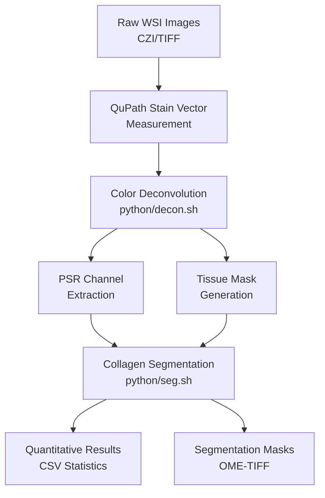

# Quick Start Guide

Get up and running with the Histology Collagen Quantification pipeline.

## Overview

This pipeline provides automated analysis of histological images stained with PSR+FG to quantify collagen content in tissue samples.

## Workflow



## Installation

Choose your preferred installation method:

| Method | Best For | Setup Time | Documentation |
|--------|----------|------------|---------------|
| **Docker** | Production, HPC, Reproducibility | 5-10 min | [Install Guide](installation.md#method-1-docker-recommended) |
| **Pixi** | Modern development, Fast setup | 2-5 min | [Install Guide](installation.md#method-2-pixi-modern-fast) |
| **Mamba/Conda** | Traditional workflows | 5-15 min | [Install Guide](installation.md#method-3-mambaconda-traditional) |

**Quick Install (Docker - Recommended):**

```bash
# Build the image
docker build -t collagen-quant .

# Run the container
docker run -it --rm -v /path/to/your/data:/data collagen-quant
```

📖 **See the complete [Installation Guide](installation.md) for platform-specific instructions.**

## Step-by-Step Workflow

### Step 1: Stain Vector Measurement in QuPath

1. Open your PSR+FG stained image in QuPath
2. Go to `Analyze` → `Preprocessing` → `Estimate stain vectors`
3. Select representative tissue regions with clear PSR and FG staining
4. Export the measured stain vectors to a JSON file in the `stain_color_map/` directory

**Example stain vector format:**
```json
{
    "PSR": [0.193, 0.75, 0.632],
    "FG": [0.718, 0.163, 0.677],
    "Residual": [-0.912, -0.281, 0.298]
}
```

### Step 2: Color Deconvolution

Run the interactive color deconvolution script to separate stain channels:

```bash
# Start the interactive script
bash python/decon.sh
```

The script will guide you through the following prompts:
1. **Data directory**: Path to your input WSI files
2. **Stain color map**: Select from available JSON files in `stain_color_map/`
3. **Scaling factor**: Downsampling level (recommended: 2 for large images)
4. **Manual masks**: Whether to use GeoJSON annotation files
5. **Batch size**: Number of parallel processes (recommended: 16)

The script will automatically:
- Scan for supported image formats (CZI, TIFF, OME-TIFF)
- Create output directories for each image
- Process all images in batch
- Provide progress feedback and error handling

### Step 3: Collagen Segmentation

Run the interactive segmentation script to quantify collagen:

```bash
# Start the interactive script
bash python/seg.sh
```

The script will guide you through the following prompts:
1. **Processed data directory**: Path containing deconvolution results
2. **Tile size**: Regional analysis tile size in pixels (recommended: 2048)
3. **Padding**: Overlap between tiles in pixels (recommended: 0-512)
4. **Class ID**: Otsu threshold class for collagen (recommended: 1)

The script will automatically:
- Validate that required PSR.ome.tiff files exist
- Process all directories containing deconvolution results
- Generate collagen segmentation masks and quantification statistics
- Display quick statistics after processing each sample

## Quick Commands

```bash
# With Docker
docker run -it --rm -v /path/to/data:/data collagen-quant
pixi run decon  # Color deconvolution
pixi run seg    # Segmentation

# With Pixi
pixi run decon
pixi run seg

# With Conda/Mamba
mamba activate collagen_quant
bash python/decon.sh
bash python/seg.sh
```

## Next Steps

- 📖 [Workflow Details](workflows.md) - Detailed workflow documentation
- ⚙️ [Configuration Guide](configuration.md) - Parameter settings and options
- 📁 [File Formats](file-formats.md) - Input/output file structure
- 🐳 [Docker Guide](docker.md) - Docker usage and HPC deployment
